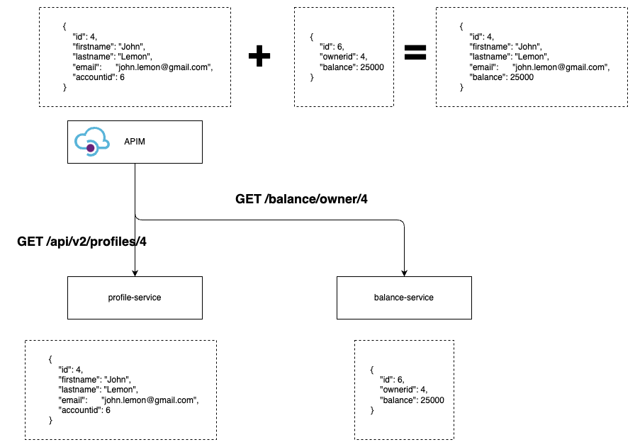

# Azure API Management - Transformation

## Request Tranformation
There are many scenarios that the API publisher want to transform the request message before send it to the backend. 
Azure API Management (APIM) allow us to do that via the policy. in this following exercise we will transform the request
message before sent to backend service

### Scenario 

Assume that the `create profile` or ` /api/profiles - POST` API that we publish via APIM requires request body as following specification

```json
{
    "profile": {
        "firstname": "string",
        "lastname": "string", 
        "email": "string"
    }
}
```

while our backend service only accept this specification

```json
{
    "firstname": "string",
    "lastname": "string",
    "email": "string
}
```

### Update API specification (Optional)
1. Login to Azure Portal and navigate to `Azure API Management` then select your instance
2. Select `APIs`, `Ananda APIM Profile API`, select `POST /api/profiles`
3. On the `Design` tab and click a pen icon in the `Frontend` then select `OpenAPI editor (JSON)` to edit the specification


4. Edit the request body specification and an example, then click save

*Line 23: Change example*
```json
    "example": {
        "profile": {
            "firstname": "John",
            "lastname": "Lemon",
            "email": "jonh.lemon@gmail.com"
        }
    }
```

*Change Request Specification (Approximately line no. 100)*

```json
"CreateProfileRequest": {
                "required": ["profile"],
                "type": "object",
                "properties": {
                    "profile": {
                        "required": ["firstname", "lastname", "email"],
                        "type": "object",
                        "properties": {
                            "firstname": {
                                "type": "string",
                                "example": "John"
                            },
                            "lastname": {
                                "type": "string",
                                "example": "Lemon"
                            },
                            "email": {
                                "type": "string",
                                "example": "jonh.lemon@gmail.com"
                            }
                        }
                    }
                }
            },
```

5. Test sending the request with new specification, at this stage it should failed

### Create policy to transform the request

1. Ensure that you click `POST /api/profiles` API and then click `Policies` on the `Inbound Processing` to open `Policy Code editor`

2. Update the  `<inbound>` policy
```xml
    <inbound>
        <base />
        <set-body>@{
                JObject inBody = context.Request.Body.As<JObject>(); 
                JObject transformed = new JObject();
                transformed["firstname"] = inBody["profile"]["firstname"];
                transformed["lastname"] = inBody["profile"]["lastname"];
                transformed["email"] = inBody["profile"]["email"];

                return transformed.ToString();
            }</set-body>
    </inbound>
```

Click save

3. Retest the API and see the result


<br/>

## Response Transformation
Same reasons as `Request Transformation` there will be scenarios that we may need to transform response before sending out to API consumers

### Scenario
Assume that the `create profile` or ` /api/profiles - POST` API that we publish via APIM requires to send out the response body as following specification

```json
{
    "profile": {
        "id": number,
        "firstname": "string",
        "lastname": "string", 
        "email": "string"
    },
    "account": {
        "balance": number
    }
}
```

while our backend service only accept this specification

```json
{
    "id": number,
    "firstname": "string",
    "lastname": "string",
    "email": "string",
    "balance": number
}
```

### Update API specification (Optional)
1. Login to Azure Portal and navigate to `Azure API Management` then select your instance
2. Select `APIs`, `Ananda APIM Profile API`, select `POST /api/profiles`
3. On the `Design` tab and click a pen icon in the `Frontend` then select `OpenAPI editor (JSON)` to edit the specification


4. Edit the request body specification and an example, then click save

*Change example (approximately line no 30)*
```json
    "responses": {
        "201": {
            "description": "Create profile successfully",
            "content": {
                "application/json": {
                    "schema": {
                        "$ref": "#/components/schemas/ProfileResponse"
                    },
                    "example": {
                        "id": 1,
                        "firstname": "John",
                        "lastname": "Lemon",
                        "email": "jonh.lemon@gmail.com",
                        "balance": 25000
                    }
                }
            }
        },
        "500": {
            "description": "Internal Server Error"
        }
    }
```

Change it to

```json
    "responses": {
        "201": {
            "description": "Create profile successfully",
            "content": {
                "application/json": {
                    "schema": {
                        "$ref": "#/components/schemas/ProfileResponse"
                    },
                    "example": {
                        "profile": {
                            "id": 1,
                            "firstname": "John",
                            "lastname": "Lemon",
                            "email": "jonh.lemon@gmail.com",
                        },
                        "account": {
                            "balance": 25000
                        }
                    }
                }
            }
        },
        "500": {
            "description": "Internal Server Error"
        }
    }
```


*Change Response Specification (Approximately line no. 120)*

```json
"ProfileResponse": {
    "required": ["id", "firstname", "lastname", "email", "balance"],
    "type": "object",
    "properties": {
        "id": {
            "type": "number",
            "example": 1
        },
        "firstname": {
            "type": "string",
            "example": "John"
        },
        "lastname": {
            "type": "string",
            "example": "Lemon"
        },
        "email": {
            "type": "string",
            "example": "jonh.lemon@gmail.com"
        },
        "balance": {
            "minimum": 0,
            "type": "number",
            "example": 25000
        }
    }
}
```

*Change it to*

```json
"ProfileResponse": {
    "required": ["profile", "account"],
    "type": "object",
    "properties": {
        "profile": {
            "type": "object",
            "required": ["id", "firstname", "lastname", "email"],
            "properties": {
                "id": {
                    "type": "number",
                    "example": 1
                },
                "firstname": {
                    "type": "string",
                    "example": "John"
                },
                "lastname": {
                    "type": "string",
                    "example": "Lemon"
                },
                "email": {
                    "type": "string",
                    "example": "john.lemon@gmail.com"
                }

            }
        },
        "account": {
            "type": "object",
            "required": ["balance"],
            "properties": {
                "balance": {
                    "type": "number",
                    "example": 25000
                }
            }
        }
    }
}
```

### Add response transformation policy
Since the new API response specification will be applied to both GET and POST APIs, we will apply this policy to `All Operations` so that it will be affected to both GET/POST APIs

1. Login to Azure Portal and navigate to `Azure API Management` then select your instance
2. Go to `APIs` menu and select `Anananda APIM Profile API`, then select `All Operations`

3. Launch `Policy code editor`
4. Update `<outbound>` policy to transform the response

```xml
<outbound>
        <base />
        <choose>
            <when condition="@(context.Response.StatusCode == 200 || context.Response.StatusCode == 201)">
                <set-body>@{
                    var org = context.Response.Body.As<JObject>();
                    JObject transformed = new JObject();
                    JObject profile = new JObject();
                    
                    profile["id"] = org["id"];
                    profile["firstname"] = org["firstname"];
                    profile["lastname"] = org["lastname"];
                    profile["email"] = org["email"];

                    JObject account = new JObject();
                    account["balance"] = org["balance"];

                    transformed["profile"] = profile;
                    transformed["account"] = account;

                    return transformed.ToString();
                    }</set-body>
            </when>
        </choose>
    </outbound>
```

5. Save and test either `GET` or `POST` APIs, it should response with new JSON response specification

<br/>

## Error handling

It is importance that we need to handle the error properly before return those error back to API consumers

In this exercise we will handle 3 error cases as an examples
- Not Found (404)
- Unauthorized (401)
- Internal Server Error (500)

1. Run the test on API `GET /api/profiles/{id}` with the id that not exist, for example `GET /api/profiles/100`


The scenario is that we want to return more meaningful response to API consumer with HTTP Code 404 along with response body instead of empty response

```json
{
    "code": 404,
    "error": "Profile not found"
}
```

2. Open the policy editor (for `All Operations`), assume that you already have the policy for transform response that we have done previously, Add another `<when>` section to it in order to process `404` and transform the response

```xml
<when condition="@(context.Response.StatusCode == 404)">
                <set-body>
                    @{
                        JObject response = new JObject();
                        response["code"] = context.Response.StatusCode;
                        response["message"] = "Profile not found";

                        return response.ToString();
                    }
                </set-body>
            </when>
```

3. Save policy and run the test again (with id=100), you should see the response similar to this


4. Next we will add another two error handling to handle the error 401 and 500

```xml
<when condition="@(context.Response.StatusCode == 401)">
                <set-body>@{
                        JObject response = new JObject();
                        response["code"] = context.Response.StatusCode;
                        response["message"] = "Unauthorized";

                        return response.ToString();
                    }</set-body>
            </when>
            <when condition="@(context.Response.StatusCode == 500)">
                <set-body>@{
                        JObject response = new JObject();
                        response["code"] = context.Response.StatusCode;
                        response["message"] = "Internal Server Error";

                        return response.ToString();
                    }</set-body>
            </when>
```

5. Save and test the API for 401 and 500 cases

*NOTE: In order to test 401, you can enabled the OAuth2.0 and call API without providing the jwt token, and for 500 you can simulate the scenario by changing the backend endpoint to something that doesn't exist*


## API Aggregation

### Before we start

In the previous exercises, the `profile-service` responsibles for aggregate data from `profile` and `balance` and combine the response then reply back to `APIM` as the following diagram


<br/>

In this exercise (and the next following `API Chain`), we will delegate this task to `APIM` to perform, please see the following diagram to understand the new architecture



<br/>

We have added few new API in both `profile-service` and `balance-service`, let's create APIs in APIM to call those new API directly


### New Added APIs

Get Profile Shallow `GET /api/v2/profiles/{id}`, This API works almost the same as the previous version except, it will not call api from `balance-service` to get the balance amount.

Example response
```json
{
    "ID": 4,
    "firstname": "Jane",
    "lastname": "Doe",
    "email": "jane@doe.com",
    "account-id": 2
}
```

Also in the `balance-service` we provided api to get balance by owner id

Example response
```json
{
    "id": 2,
    "owner": 4,
    "balance": 50000
}
```


Now, we will create the new API to aggregate both APIs and return the result to API consumers both profile and balance

1. Create new API (HTTP) with prefix `aggregation`


2. Add new operation 
- GET
- /profiles/{id}

3. After create new operations, open the `policy code editor`, the following code is for aggregate the response from both sources

*NOTE: Please change the authentication-cerfificate thumbprint*

```xml
<inbound>
        <base />
        <!-- Get profile ID from path parameters -->
        <set-variable name="profileId" value="@(context.Request.MatchedParameters["id"])" />
        <!-- Set request to profile service -->
        <send-request mode="new" response-variable-name="profiledetails" timeout="20" ignore-error="true">
            <set-url>@($"https://ananda-mock-api.z-unified.com/api/v2/profiles/{(string)context.Variables["profileId"]}")</set-url>
            <set-method>GET</set-method>
            <set-header name="Content-Type" exists-action="override">
                <value>application/json</value>
            </set-header>
            <authentication-certificate thumbprint="088939652FBE42760D567EA0EB7021521ABFED1F" />
        </send-request>
        <!-- Set request to balance service -->
        <send-request mode="new" response-variable-name="balancedetails" timeout="20" ignore-error="true">
            <set-url>@($"https://ananda-rep-api.z-unified.com/balance/owners/{(string)context.Variables["profileId"]}")</set-url>
            <set-method>GET</set-method>
            <set-header name="Content-Type" exists-action="override">
                <value>application/json</value>
            </set-header>
            <authentication-certificate thumbprint="088939652FBE42760D567EA0EB7021521ABFED1F" />
        </send-request>
        <return-response>
            <set-status code="200" reason="OK" />
            <set-header name="Content-Type" exists-action="override">
                <value>application/json</value>
            </set-header>
            <set-body>@{
                    var profile = ((IResponse)context.Variables["profiledetails"]).Body.As<JObject>();
                    var balance = ((IResponse)context.Variables["balancedetails"]).Body.As<JObject>();
                    
                    JObject response = new JObject();
                    response["id"] = profile["id"];
                    response["firstname"] = profile["firstname"];
                    response["lastname"] = profile["lastname"];
                    response["email"] = profile["email"];

                    
                    response["balance"] = balance["balance"];

                    return response.ToString();
                }</set-body>
        </return-response>
    </inbound>
```

4. Save and test the API

<br/>

## API Chain

This exercise is quite similar to the previous exercise, just only we need the wait for the response from the first request and use the data from the returned response used as a request parameter to request to the second API

*Architecture*


1. Create new operations 

*NOTE: Use difference sufix than the previous exercise, e.g. `/chain/profiles/{id}`*

2. After create operations, open `policy code editor`
3. Edit policy, using example code below

*Inbound section*

```xml
<inbound>
    <base />
    <rewrite-uri template="/api/v2/profiles/{id}" />
</inbound>
```

*Outbound section*

```xml
<outbound>
        <base />
        <choose>
            <when condition="@(context.Response.StatusCode == 200)">
                <send-request mode="new" response-variable-name="balancedetails" timeout="20" ignore-error="true">
                    <set-url>@{
                            var accountId = context.Response.Body.As<JObject>(preserveContent: true)["account-id"];
                            return $"https://ananda-rep-api.z-unified.com/balance/accounts/{(string)accountId}";
                        }</set-url>
                    <set-method>GET</set-method>
                    <set-header name="Content-Type" exists-action="override">
                        <value>application/json</value>
                    </set-header>
                    <authentication-certificate thumbprint="088939652FBE42760D567EA0EB7021521ABFED1F" />
                </send-request>
                <return-response>
                    <set-status code="200" reason="OK" />
                    <set-header name="Content-Type" exists-action="override">
                        <value>application/json</value>
                    </set-header>
                    <set-body>@{
                            var profile = context.Response.Body.As<JObject>();
                            var balance = ((IResponse)context.Variables["balancedetails"]).Body.As<JObject>();
                            JObject response = new JObject();
                            response["id"] = profile["id"];
                            response["firstname"] = profile["firstname"];
                            response["lastname"] = profile["lastname"];
                            response["email"] = profile["email"];
                            response["balance"] = balance["balance"];

                            return response.ToString();
                        }</set-body>
                </return-response>
            </when>
        </choose>
    </outbound>
```

*NOTE: authentication-certificate thumbprint required change*


<br/>
<br/>

## Fallbacks

There might be some scenarios that some of the backend service may be unavailable and if that backend service is a part of the aggregation APIs and make the overall response to be error.

However, some scenarios this is not what business would want it and usually in term of business perspective, it'd be better to return some default/fallback response rather than return error

<br/>

*NOTE: This is not apply to all cases, some of the business critical it's better to return error than general data, e.g. account balance, loyality points, etc. but some use case it's ok to return general response, e.g. preference, personalization, etc.*

<br/>

### Scenario

**Happy Path**


**Corner/Failed case**


### Exercise

1. Create another operation (within the same API as previous exercise), with difference suffix, e.g. `fallback`
2. After create, open `Policy Code editor`

3. These following example is the policy to apply the fallback mechanism to handle the failed/corner case

```xml

```